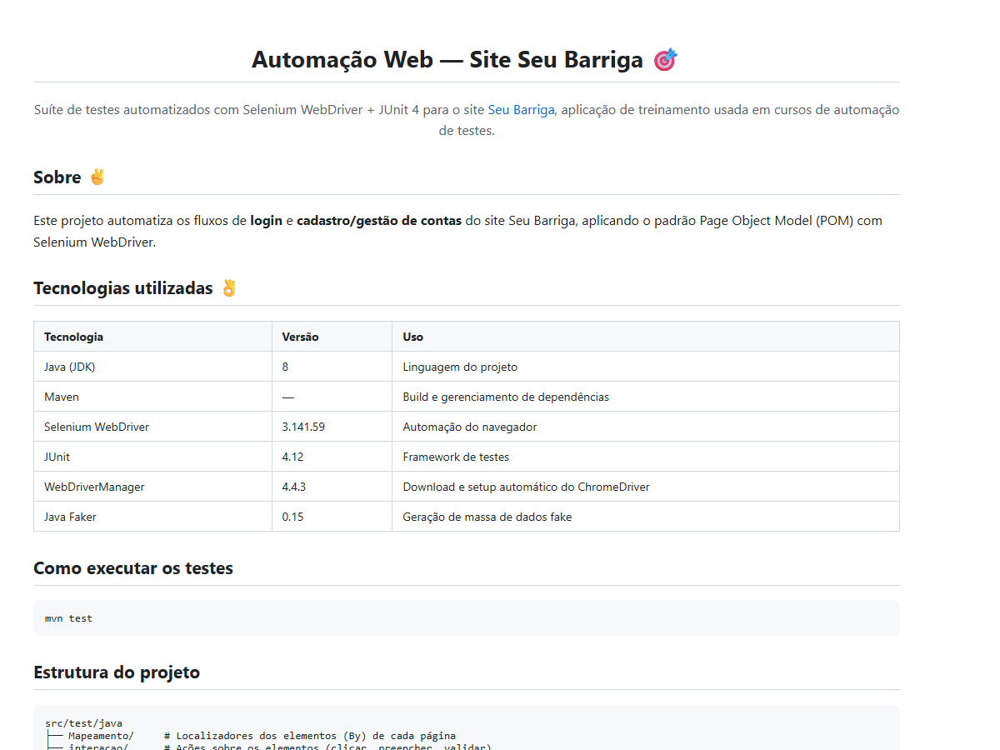
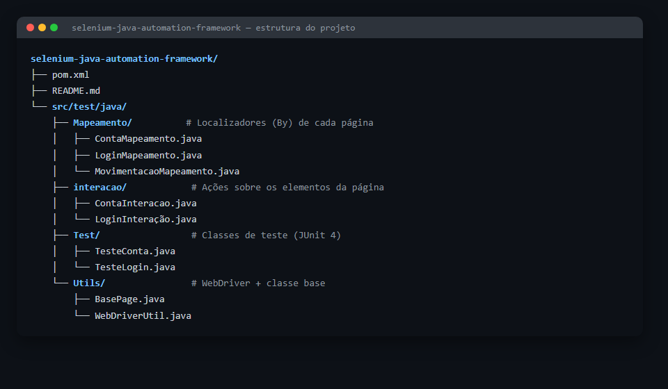
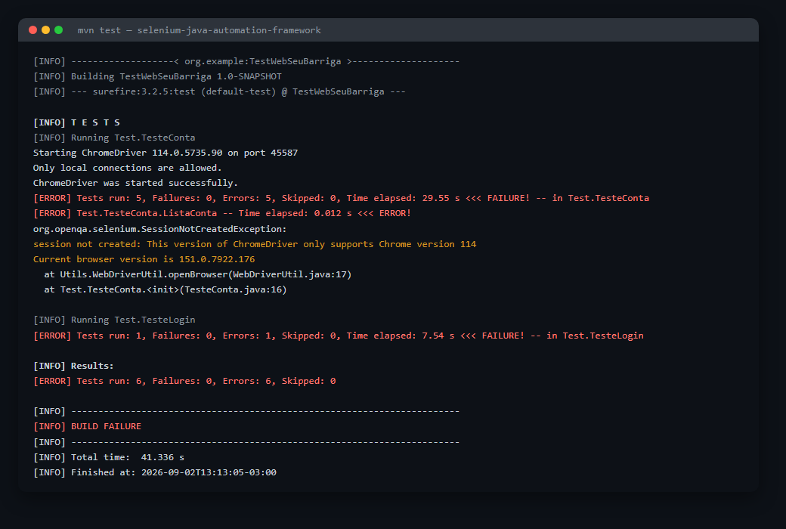

<h1 align="center">Automação Web — Site Seu Barriga 🎯</h1>

<p align="center">
  Suíte de testes automatizados com Selenium WebDriver + JUnit 4 para o site
  <a href="https://seubarriga.wcaquino.me/">Seu Barriga</a>, aplicação de treinamento usada em cursos de automação de testes.
</p>

## Sobre ✌

Este projeto automatiza os fluxos de **login** e **cadastro/gestão de contas** do site
[Seu Barriga](https://seubarriga.wcaquino.me/salvarConta), aplicando o padrão Page Object Model (POM)
com Selenium WebDriver.

## Tecnologias utilizadas 👌

| Tecnologia | Versão | Uso |
|---|---|---|
| [Java (JDK)](https://www.oracle.com/br/java/technologies/javase/javase-jdk8-downloads.html) | 8 | Linguagem do projeto |
| [Maven](https://maven.apache.org/) | — | Build e gerenciamento de dependências |
| [Selenium WebDriver](https://mvnrepository.com/artifact/org.seleniumhq.selenium/selenium-java/3.141.59) | 3.141.59 | Automação do navegador |
| [JUnit](https://junit.org/junit4/) | 4.12 | Framework de testes |
| [WebDriverManager](https://github.com/bonigarcia/webdrivermanager) | 4.4.3 | Download e setup automático do ChromeDriver |
| [Java Faker](https://github.com/DiUS/java-faker) | 0.15 | Geração de massa de dados fake |

> **Navegador:** os testes rodam no **Google Chrome** (é necessário tê-lo instalado localmente; o driver é baixado automaticamente pelo WebDriverManager).

## Pré-requisitos

- JDK 8 instalado e configurado (`JAVA_HOME`)
- [Maven](https://maven.apache.org/download.cgi) instalado
- Google Chrome instalado
- Conexão com a internet (o WebDriverManager baixa o ChromeDriver e os testes acessam o site remotamente)

## Como baixar o projeto

```bash
git clone https://github.com/Gustacardoso/selenium-java-automation-framework.git
cd selenium-java-automation-framework
```

## Como executar os testes

```bash
mvn test
```

Cada classe de teste abre uma nova instância do Chrome, executa o fluxo e fecha o navegador ao final.

## Estrutura do projeto

```
src/test/java
├── Mapeamento/     # Localizadores dos elementos (By) de cada página
├── interacao/      # Ações sobre os elementos (clicar, preencher, validar)
├── Test/           # Classes de teste (JUnit 4)
└── Utils/          # Infraestrutura: inicialização do WebDriver e classe base
```

O projeto segue uma variação do **Page Object Model** dividida em duas camadas por funcionalidade:

- **Mapeamento** — concentra apenas os `By` (localizadores) da tela.
- **interacao** — usa os localizadores do Mapeamento correspondente para executar ações (preencher campo, clicar em botão, ler mensagem).
- **Test** — orquestra o cenário chamando os métodos da camada de interação e faz as validações com `Assert`.
- **Utils** — `WebDriverUtil` inicializa o `ChromeDriver` via WebDriverManager e navega até a URL da aplicação; `BasePage` é a classe base que expõe o `driver` para Mapeamento e interacao.

Cenários cobertos atualmente:

- **Login**: `TesteLogin` — login com sucesso.
- **Conta**: `TesteConta` — cadastro sem nome, cadastro com sucesso, listagem, alteração e remoção de conta.

## Screenshots

| README | Estrutura do projeto | Execução dos testes |
|---|---|---|
| [](docs/screenshots/readme.png) | [](docs/screenshots/estrutura-projeto.png) | [](docs/screenshots/execucao-testes.png) |

## Limitações conhecidas / roadmap

Este projeto tem fins didáticos e possui alguns pontos em aberto:

- URL da aplicação e credenciais de login estão fixas no código (`WebDriverUtil` e `LoginInteração`), em vez de externalizadas em arquivo de configuração.
- Sem suporte a outros navegadores além do Chrome, e sem execução em Selenium Grid.
- Sem execução paralela de testes.
- Sem geração de relatório de execução (ex.: Allure/ExtentReports) nem pipeline de CI/CD configurados.
- Selenium 3.141.59 e JDK 8 estão desatualizados; uma futura migração para Selenium 4 e uma versão mais recente do Java é recomendada.
- No ambiente atual, `mvn test` falha com `SessionNotCreatedException`: o WebDriverManager 4.4.3 baixa o ChromeDriver 114, incompatível com versões recentes do Chrome (151+). É necessário atualizar o WebDriverManager (ou fixar a versão do ChromeDriver) para rodar a suíte localmente.

## Aplicação sob teste

[https://seubarriga.wcaquino.me](https://seubarriga.wcaquino.me)
